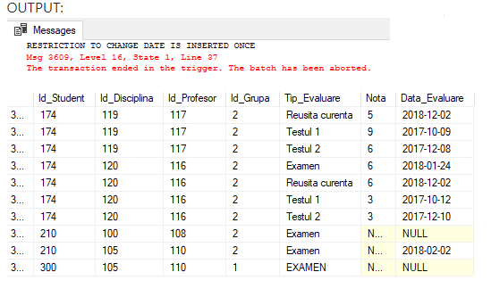
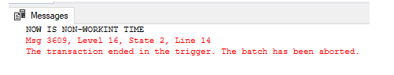

# Laboratory work nr. 10
-----
## Topic : *Creating and using Triggers*
### Author : *Colta Victor*
-----
## Objectives :
Get familiar with Triggers and their usage;

## Course of the work :
### Quiz :

1. Triggers can be used in the following ways :

   * To improve data integrity i.e. to check if the manipulation of data concurs with the underlying conditions;

   * Another use of triggers can be to carry out an action when a specific criterion has been met.

2. Types of DML triggers : AFTER, INSTEAD OF, CLR;

3. Usage of tables **deleted** and **inserted** :

   * Testing the efect of some modifications;

   * To extend the referential integrity between tables;

   * Insert of update the data in a tables used by a view;

4. DDL triggers are used to control the events at the level of database or server. They launch a stored procedure as an answer for an event. They are not activated by DML, but DDL instructions.

5. LOGON triggers are stored procedures which launch an answer to a LOGON event. This events appear when an user session is started. Therefore these triggers are not launched if the authentification fails.

6. Basic syntax to create triggers :

```sql
CREATE [ OR ALTER ] TRIGGER [ schema_name . ]trigger_name
ON { table | view }
[ WITH <dml_trigger_option> [ ,...n ] ]
{ FOR | AFTER | INSTEAD OF }
{ [ INSERT ] [ , ] [ UPDATE ] [ , ] [ DELETE ] }
[ WITH APPEND ]
[ NOT FOR REPLICATION ]
AS { sql_statement  [ ; ] [ ,...n ] | EXTERNAL NAME <method specifier [ ; ] > }

<dml_trigger_option> ::=
    [ ENCRYPTION ]
    [ EXECUTE AS Clause ]

<method_specifier> ::=
    assembly_name.class_name.method_name
```

7. To activate and deactivate triggers use:

   * ENABLE TRIGGER name ON table;

   * DISABLE TRIGGER name ON table;

8. To acces the metadata of the triggers see: sys.triggers,  sys.triggers_events, sp_helptext etc.


### Practical Assignments :
1. Change the new recorder trigger so that if the audience updates, an information message appears, which, besides discipline and time, will display the affected group code, the day, the block, the old audience, and the new audience.

See the script at (https://github.com/ColVic/BCD_Labs/tree/master/Lab10/queries/SQLQuery1.sql)

2. Create the trigger, which would ensure the correct (consecutive) population success of the students and students_reusita tables, and would allow the avoidance of key errors.

See the script at (https://github.com/ColVic/BCD_Labs/tree/master/Lab10/queries/SQLQuery2.sql)

3. Create a trigger that would prohibit lowering scores in the student_reusita table and changing values in the Values_Data field, where the values in this field are null. The trigger must only be launched if the data of students in group "CIB 171" are affected. A warning message will be displayed in case of an attempt to violate the constraint.

See the script at (https://github.com/ColVic/BCD_Labs/tree/master/Lab10/queries/SQLQuery3.sql)



4. Create a DDL trigger that would prohibit modifying the ld_Disciplinary column in the university table tables with the message display.

See the script at (https://github.com/ColVic/BCD_Labs/tree/master/Lab10/queries/SQLQuery4.sql)

5. Create a DDL trigger that would prohibit changing the schema of the database outside work hours.

See the script at (https://github.com/ColVic/BCD_Labs/tree/master/Lab10/queries/SQLQuery5.sql)



6. Create a DDL trigger that, when changing the properties of the ld_Professor column in a table, would make similar changes automatically in the rest of the tables.

See the script at (https://github.com/ColVic/BCD_Labs/tree/master/Lab10/queries/SQLQuery6.sql)

## Conclusions :

Triggers are useful when it comes to big amounts of data in order to optimize validations or perform multiple queries at same time. Although, they are hard to maintenance and test.
