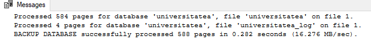
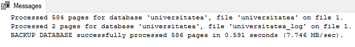
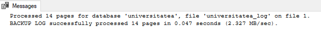
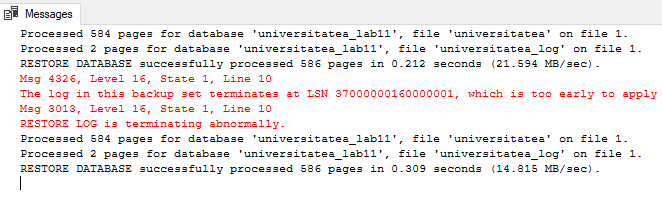
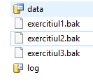

# Laboratory work nr. 11
-----
## Topic : *Database Recovery*
### Author : *Colta Victor*
-----
## Objectives :
Study the backup and recovery methods

## Course of the work :

### Practical Assignments :
1. Create a Backup file. Complete a full database backup of the university in this folder. The backup file is called exercitiul1.bak. Write the respective SQL statement.

See the script at (https://github.com/ColVic/BCD_Labs/tree/master/Lab11/queries/SQLQuery1.sql)

2. Write the instruction for a differential backup of the university database. The file of the backup copy is called the exercitiul2.bak.

See the script at (https://github.com/ColVic/BCD_Labs/tree/master/Lab11/queries/SQLQuery2.sql)

3. Write the instruction for a backup of the university's database transaction log. The backup file is called the exercitiul3.bak.

See the script at (https://github.com/ColVic/BCD_Labs/tree/master/Lab11/queries/SQLQuery3.sql)

4. Perform the consecutive restoration of all backup copies created. Recovery must be done in a new university_labll database. . The new database files are in the BD_labll folder. Write the respective SQL statements.

See the script at (https://github.com/ColVic/BCD_Labs/tree/master/Lab11/queries/SQLQuery4.sql)

