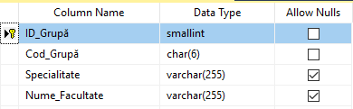
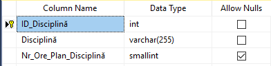
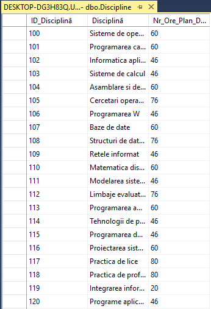
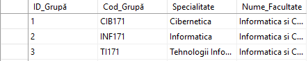

# Laboratory work nr. 3
-----
## Topic : *Database Creation and Table Modification in SQL SERVER Management Studio*
### Author : *Colta Victor*
-----
## Objectives :
1. Ability to create, rename and update a database;
2. Transact-SQL, data types and build-in functions;
3. Constraints;

## Course of the work :
### Quiz :
1. Each column in a table should contain obligatory some specifications i.e. name, data type.
2. The datatypes used by SQL Server 2017 are :
  - Integer types(Exact Numbers) :
    - **BIGINT** - 8 bytes;
    - **INT** - 4 bytes;
    - **SMALLINT** - 2 bytes;
    - **TINYINT** - 1 byte;
    - **BIT** - Binary;
    - **DECIMAL(P[,S]) or NUMERIC(P[,S])** - (P - total number of digits), (S - number of digits after point);
    - **MONEY** - 8 bytes;
    - **SMALLMONEY** - 4 bytes;
  - Floating-point numbers :
    - **FLOAT(N)** - 4 or 8 bytes (N - precision; Nmax = 53);
    - **REAL** - FLOAT(24);
  - Strings :
    - **CHAR(N)** - max 8Kb, fixed length;
    - **VARCHAR[(N | MAX)]** - max 8Kb, variable length;
    - **TEXT** - > 8Kb and < 2Gb;
  - Binary :
    - **BINARY(N)** - max 8Kb, fixed length;
    - **VARBINARY[(N | MAX)]** - max 8Kb, variable length;
    - **IMAGE** - > 8Kb and < 2Gb(GIF, JPEG, etc.);
  - Date/Time:
    - **DATETIME** - dd/mm/yyyy;
    - **DATETIME2** - extension of DATETIME;
    - **DATE** - any valid date;
    - **TIME** - hh/mm/ss/ms;
    - **DATETIMEOFFSET**;
    - **SMALLDATETIME**;
  - Special :
    - **CURSOR** - cursor reference;
    - **HIERARCHYID** - hierarchy positions;
    - **SQL_VARIANT** - values of different data types;
    - **TABLE** - a heap of rows;
    - **TIMESTAMP** - 8Kb;
    - **UNIQUEIDENTIFIER** - Global Unique ID;
    - **XML** - stores XML data;
3. Integrity Constraints :
  - **NOT NULL**;
  - **UNIQUE**;
  - **PRIMARY KEY**;
  - **FOREIGN KEY**;
  - **CHECK**;
4. Some dependencies between tables may be lost. Also there are columns which cannot be deleted so there can appear errors when trying to delete one.
5. Existing info may be afected. Some errors may appear if some constraints are not satisfied. Examples of columns which cannot be modified are : columns with type **TIMESTAMP** or **UNIQUEIDENTIFIER**, associated with **DEFAULT**, **PRIMARY KEY** column etc.

### Practical Assignments :
1. a) 16,2 or b) 116,2;

2. **DECIMAL**;

3. I've created the tables in the database **Universitate** with the properties as in the figures below :

4. Now, I've inserted the given data into the tables :

## Conclusions :

1. The creation of the database is important step as we are defining the right constraints to work with data.

2. It is a good practice to think in advance what we need to store in a column and what values can it have so that we could pick the optimal data type.
