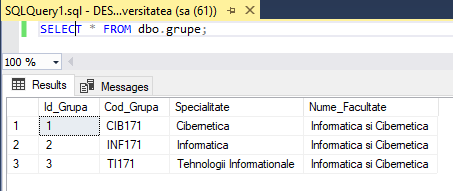

# Laboratory work nr. 4
-----
## Topic : *SELECT instruction Transact-SQL*
### Author : *Colta Victor*
-----
## Objectives :
1. Get familiar with Transact-SQL and its usage;

## Course of the work :
### Quiz :

1. Some of the facilities that Transact-SQL Query Editor offers us are :

    * Visualization of the data in form of grid or text, using SQL commands;
    * Analizing the plan of execution of the query;
    * Online help of Transact-SQL;

2. SQL instructions are divided in 4 groupes :

    * DDL (Data Definition Language) - This instructions are used for creation, insertion or modification purposes;

    * DML (Data Manipulation Language) - These are used for manipulation of the data i.e. inserting, modifying rows of data;

    * DCL (Data Control Language) - Used for creating roles, permissions also for the administration to the database;

    * TCL (Transactional Control Language) - Used for the management of the transactions from database;

3. The operators used in Transact-SQL expressions are :

    * Arithmetic operators (+, -, *, /, %);

    * Char operator (+ i.e. concatenation);

    * Comparison operators (=, <>, >=, <=, <, >, !=, !>, !<);

    * Logical operators (AND, OR, ANY, SOME, NOT, LIKE, IN, EXISTS, BETWEEN, ALL);

    * Bitwise operators (&, |, ~, ^);

    * LIKE

4. Syntax of SELECT instruction :

   SELECT [ALL|DISTINCT] <Columns>
      FROM <Tables>
      [WHERE <condition>] [Other clauses];

5. Functions of Transact-SQL :

    * Single row (UPPER, LOWER, SUBSTRING, LEN, REPLACE, CONCAT);

    * Aggregate (SUM, AVG, MAX, MIN, COUNT);

6. Types of join queries :

    * INNER JOIN;

    * OUTER JOIN;

    * LEFT JOIN;

    * RIGHT JOIN;

7. Related queries are queries which appear inside another querry, usually in the WHERE clause;

8. INTERSECT and EXCEPT are 2 examples of set operations. They corespond with Intersections and Difference operations from set theory;

9. The TOP clause is used to limit the number of lines returned by a instruction. Also in tandem with ORDER BY to the TOP clause we can use WITH TIES to get all the ties;

### Practical Assignments :
1. 1st Query :

2. 21st Query

3. 25th Query

## Conclusions :

   Transact-SQL has a variety of commands used for selecting database data in the most convenient way. We can also join multiple tables to combine data and obtain the desired results. Aggregation functions are useful when it comes to counting, finding average values, and so on.