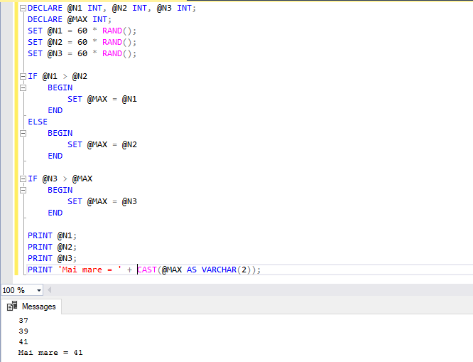
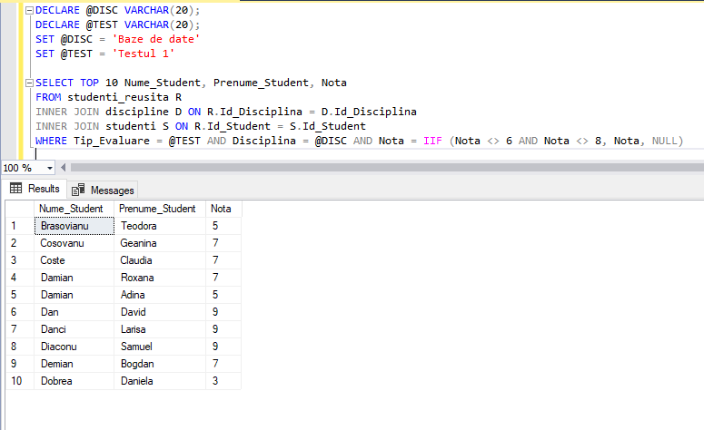
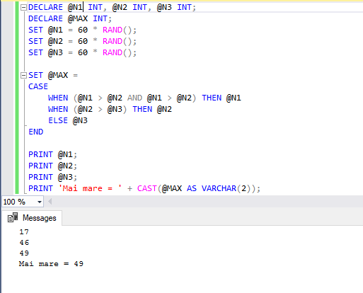
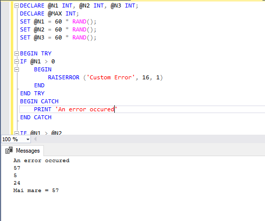

# Laboratory work nr. 5
-----
## Topic : *Procedural instructions in Transact-SQL*
### Author : *Colta Victor*
-----
## Objectives :
1. Get familiar with procedural Transact-SQL and its usage;
2. Sudy the conditional, repetitive and error handling instructions;

## Course of the work :
### Quiz :

1. Types of blocks in Transact-SQL :

    * Anonim blocks - defined in an app and with no name;

    * Procedures - blocks with name, parameters and no return value;

    * Functions - blocks with name, parameters and return value;

2. A local variable is declared with the keyword DECLARE in the following way :

    DECLARE @name data_type

   Then a value can be set with SET keyword :

    SET @name = value

3. WHILE loop expression gives us a repetitive structure which executes while a boolean expression is satisfied. We can use different expressions to exit or manipulate the repetitions like BREAK, CONTINUE etc.

4. CASE expression permits us to execute different blocks depending on the result of a condition. We use WHEN to specify the different results.

5. IF..ELSE structure enables us to first verify a condition and perform the attached block and otherwise if the condition is not acomplished we can specify another block to execute.

6. An exception is a problem/error which does not permit our program to run. These are treated using error handlers which give us the possibility to catch and to visualize an exception.

7. RAISERROR is used to generate an error message by the user whenever is needed.

### Practical Assignments :
1.

2.

3.

4.

## Conclusions :

   There are many cases when we need to store values localy and use them after. For this we use variables. For decision making and repeating the same task multiple times we have alternative and repetitive structures.

   Some times may appear exceptions and it is a good practice to use exception handlers. Also for debuging or other purpose Transact-SQL offers us a statement to raise an exception.
