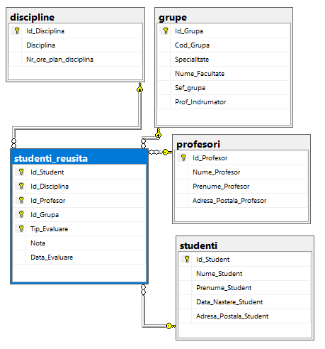
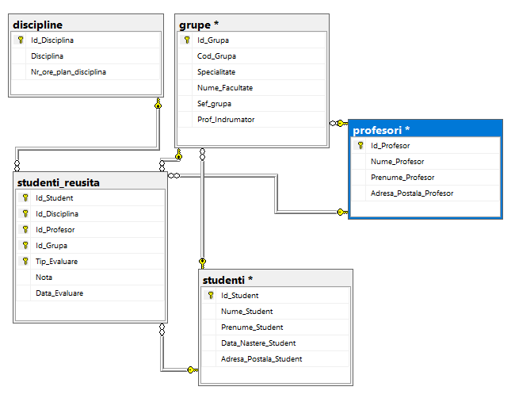
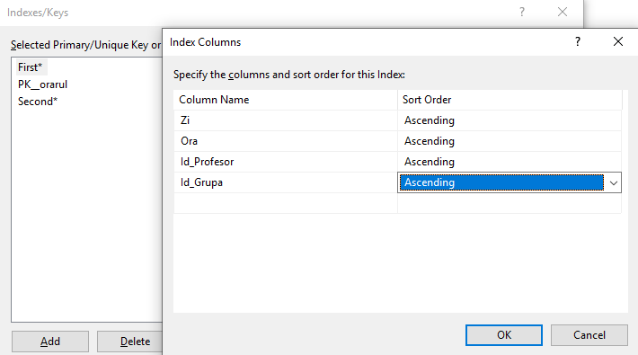
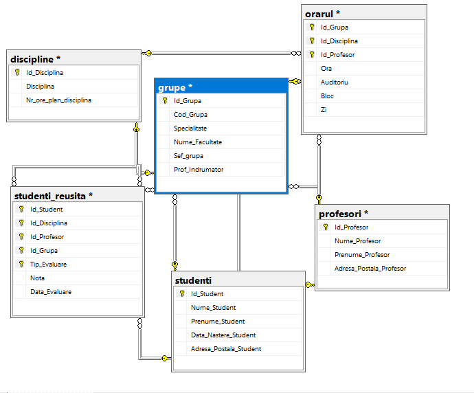
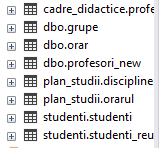

# Laboratory work nr. 7
-----
## Topic : *Diagrams, Schemes and Synonims*
### Author : *Colta Victor*
-----
## Objectives :
1. Get familiar with Diagrams, Schemes and Synonims;

## Course of the work :
### Quiz :

1. Diagrams are used in SQL Server with the scope of having an easier visualization of the database and its tables and also to have a quick access to the relations between tables and to the tables itselfs;

2. The use of Schemes offer us more advantages. For example these simplify the process of maintenation of the data and offer the possibility to create subsets which can be managed as a whole. These can be used to limit the seen objects for the user or a group of users.

3. Basic syntax to create a Schema

```
CREATE SCHEMA clause_name_schema [<element_schema> [...n]]
<clause_name_schema> ::=
   {
      name_schema
      <element_schema> [ ... n] ]
      I AUTHORIZATION name_owner
      I name_schema AUTHORIZATION name_owner }
      < element schema > ::=
      { definition_table I definition_view I give_rights
         take_rights I forbid_rights}
```

4. Before deleting a schema all the included objects should be moved or deleted.

5. The synonim gives another name to an existing object. These create another abstractization level which protects the client app from modifying the basic objects.

6. Basic syntax to create a Synonim

```
CREATE SYNONYM [ name_schema_1. ] name_synonym FOR < object >
< object > ::=
{
   [ name_server.[database].[name_schema_2].name_object
   I name database. [name_schema_2]. I name_schema_2.] nume_object
}
```

### Practical Assignments :
1. Create the diagram of university database, that will include the following tables: Profesori, Studenti, Studenti_reusita, Grupe, Discipline;



2. Add the referential constraints with tables studenti and profesori for columns Sef_grupa and Prof_indrumator from table grupe;



3. Add the table orarul to the diagram;

4. Add secondary keys to the table orarul;



5. Also define FK-PK constraints to the table orarul;



6. Create 3 new schemas in the universitatea database: cadre_didactice, plan_studii and studenti. Transfer the table profesori to the schema cadre_didactice, tables orarul, discipline to the schema plan_studii, and the tables studenti, studenti_reusita to the schema studenti.

```
ALTER SCHEMA cadre_didactice TRANSFER dbo.profesori
ALTER SCHEMA plan_studii TRANSFER dbo.orarul
ALTER SCHEMA plan_studii TRANSFER dbo.discipline
ALTER SCHEMA studenti TRANSFER dbo.studenti
ALTER SCHEMA studenti TRANSFER dbo.studenti_reusita
```



7. Modify 3 querries from the 4th lab with renamed table names.

```
SELECT *
FROM studenti.studenti
WHERE Nume_Student LIKE '%u'

SELECT Disciplina, AVG(Nota) AS AvgMark
FROM plan_studii.discipline AS C, studenti.studenti_reusita AS D
WHERE C.Id_Disciplina = D.Id_Disciplina and
Tip_Evaluare = 'Examen'
GROUP BY Disciplina
HAVING AVG(Nota) >7.0
ORDER BY Disciplina DESC

SELECT Cod_Grupa, COUNT(DISTINCT Id_Student) AS Studenti_in_Grupa
FROM grupe AS C
INNER JOIN studenti.studenti_reusita AS D ON C.Id_Grupa = D.Id_Grupa
GROUP BY Cod_Grupa HAVING COUNT(DISTINCT Id_Student) > 24
```

8. Create synonyms to simplify the previous querries.

```
CREATE SYNONYM DISC FOR plan_studii.discipline
CREATE SYNONYM STUD FOR studenti.studenti
CREATE SYNONYM STUD_R FOR studenti.studenti_reusita

SELECT Disciplina
FROM DISC
WHERE LEN(Disciplina) > 20

SELECT Nume_Student, Prenume_Student, COUNT(Nota) AS Note
FROM STUD s FULL JOIN STUD_R r ON s.Id_Student = r.Id_Student
GROUP BY Nume_Student, Prenume_Student
ORDER BY Nume_Student

SELECT Disciplina, AVG(Nota) AS Media
FROM DISC d INNER JOIN STUD_R r ON d.Id_Disciplina = r.Id_Disciplina
GROUP BY Disciplina HAVING AVG(Nota) > 7.0
ORDER BY Disciplina
```


## Conclusions :

   There are utilities in SQL Server that help us have an improved and more precise controler over the structure of the data like diagrams.

   Schemas are use to define the blue-print of the table.
