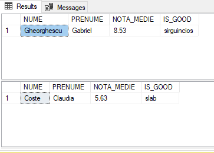

# Laboratory work nr. 9
-----
## Topic : *Stored Procedures and Functions defined by the user*
### Author : *Colta Victor*
-----
## Objectives :
1. Get familiar with Stored Procedures and Functions;

### Practical Assignments :
1. Create stored procedures stored on exercise basis (2 exercises) in Chapter 4. Input parameters must meet the criteria in the WHERE clauses of those exercises.

[For the script see query1](https://github.com/ColVic/BCD_Labs/tree/master/Lab9/queries/query1.sql)

2. Create a stored procedure that has no input parameter and has an output parameter. The exit parameter must return the number of students who have not supported at least one form of assessment (note less than 5 or NULL).

[For the script see query2](https://github.com/ColVic/BCD_Labs/tree/master/Lab9/queries/query2.sql)

3. Create a stored procedure that would insert information about a new student into the database. as input parameters to serve the new student's personal data and the GroupID. Generate all the key entries required in the student_reusita table. Evaluation notes to be inserted as NULL.

[For the script see query3](https://github.com/ColVic/BCD_Labs/tree/master/Lab9/queries/query3.sql)

4. Whether a professor is relieved from office at the middle of the semester. Create a stored procedure that would reallocate records from the student_reusita table to another teacher. Input Parameters: First and last name of the old teacher, name and surname of the new teacher, discipline. if the inserted data is incorrect or incomplete, display a warning message.

[For the script see query4](https://github.com/ColVic/BCD_Labs/tree/master/Lab9/queries/query4.sql)

5. Create a stored procedure that would form a list of the top 3 best students in a discipline, and add these marks to the final exam with one point (the maximum possible mark is 10). as an input parameter, will serve as the name of the discipline. The procedure returns the following fields: Cod_ Grupa, Nume_Prenume_Student, Disciplina, Nota _ Veche, Nota _ Noua.

[For the script see query5](https://github.com/ColVic/BCD_Labs/tree/master/Lab9/queries/query5.sql)

6. Create user-defined functions based on the exercises (2 exercises) in Chapter 4. Input parameters must meet the criteria in the WHERE clauses of those exercises.

[For the script see query6](https://github.com/ColVic/BCD_Labs/tree/master/Lab9/queries/query6.sql)

7. Write the function that would calculate the student's age. Define the following function format: ( _Student>).

[For the script see query7](https://github.com/ColVic/BCD_Labs/tree/master/Lab9/queries/query7.sql)

8. Create a user-defined function that would return the data about a student's success. The following function format is defined: <Junction Name (). Show the table with the following fields: Nume_Prenume_Student, Disticplina, Nota, Data_Evaluare.

[For the script see query8](https://github.com/ColVic/BCD_Labs/tree/master/Lab9/queries/query8.sql)

9. It is required to perform a user-defined function that would find the most lenient or weakest student in a group. Define the following function format: (, <is_good>). The parameter <is_good> can accept the values "sarguincios" or "slab" respectively. The function returns a table with the following fields: Grupa, Nume_Prenume_Student, Nota Medie , is_good. Note Average to be accurate to 2 decimal places.

[For the script see query9](https://github.com/ColVic/BCD_Labs/tree/master/Lab9/queries/query9.sql)

## Conclusions :

